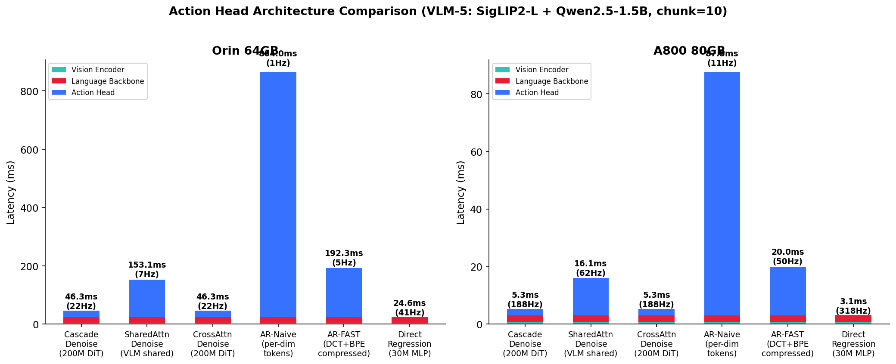

# VLA-Perf++: Roofline Benchmark for Vision-Language-Action Models

An analytical performance benchmark for **80 VLA model configurations**, systematically evaluating how different Vision Encoder, Language Backbone, and Action Head topologies affect inference latency on edge and server hardware.

Built on [NVIDIA VLA-Perf](https://arxiv.org/abs/2602.18397) and [GenZ LLM Analyzer](https://github.com/abhibambhaniya/GenZ-LLM-Analyzer).

## Analysis Results

See **[docs/ANALYSIS.md](docs/ANALYSIS.md)** for the full controlled-variable analysis with 17 key insights and architecture ranking.

<p align="center">

</p>

## Supported Architectures

### 6 Action Head Topologies

| Type | Connection | Inference | Representative Models |
|------|-----------|-----------|----------------------|
| **Cascade Denoise** | VLM → separate DiT (cross-attn) | DiT × N denoising steps | GR00T N1, CogACT, DexVLA |
| **SharedAttn Denoise** | Action tokens enter VLM self-attn | VLM × N steps (KV cache reused) | pi0, ForceVLA, OneTwoVLA |
| **CrossAttn Denoise** | Separate DiT with cross-attn to VLM | DiT × N steps | SmolVLA, GR-3 |
| **AR-Naive** | VLM outputs per-dim discrete tokens | 1 token at a time × (dof × chunk) | OpenVLA, RT-2 |
| **AR-FAST** | VLM outputs DCT+BPE compressed tokens | 1 token at a time × (tokens/5) | pi0-FAST |
| **Direct Regression** | VLM hidden → MLP → continuous actions | Single forward pass | OpenVLA-OFT, BridgeVLA |

### 3 Vision Encoders

| Key | Model | Parameters | Tokens |
|-----|-------|-----------|--------|
| V-S | SigLIP2-B/16 | 86M | 256 |
| V-M | SigLIP2-L/16 | 307M | 576 |
| V-L | SigLIP2-So400m | 400M | 256 |

### 3 Language Backbones

| Key | Model | Parameters |
|-----|-------|-----------|
| L-S | Qwen2.5-0.5B | 0.5B |
| L-M | Qwen2.5-1.5B | 1.5B |
| L-L | Qwen2.5-3B | 3B |

### 3 Action Head Sizes (for Cascade/CrossAttn/Regression)

| Size | Denoise Expert | MLP Head |
|------|---------------|----------|
| S | 50M | 10M |
| M | 200M | 30M |
| L | 450M | 80M |

### Supported Hardware (25+ platforms)

| Platform | Type | BF16 TFLOPS | Memory BW |
|----------|------|-------------|-----------|
| Jetson AGX Orin 64GB | Edge | ~138 (FP16) | 204 GB/s |
| A800 80GB | Server | 312 | 2039 GB/s |
| H100 SXM | Server | 989 | 3350 GB/s |
| RTX 4090 / 5090 | Desktop | 165 / 209 | 1008 / 1792 GB/s |
| B100 / GB200 | Server | 1750 / 2250 | 8000 GB/s |

Full list in GenZ `system_configs.py`.

## Quick Start

### 1. Install

```bash
# Install GenZ backend
cd ../vla-perf/genz && pip install -e .

# Install dependencies
cd ../../VLA-Scaling && pip install -r requirements.txt
```

### 2. Run Benchmark

```bash
# All 80 configs on Orin + A800 (~30s)
python scripts/run_benchmark.py

# Specific phase / group / configs
python scripts/run_benchmark.py --phase P0
python scripts/run_benchmark.py --group D
python scripts/run_benchmark.py --configs 1 5 17

# Different hardware / precision
python scripts/run_benchmark.py --systems H100 RTX_4090
python scripts/run_benchmark.py --bits int8
```

### 3. Run Scaling Experiments

```bash
python scripts/run_scaling.py --experiment q1   # Component scaling
python scripts/run_scaling.py --experiment q4   # Action architecture
python scripts/run_scaling.py --experiment all
```

### 4. Generate Comparison Figures

```bash
# All 6 controlled-variable comparison figures
python scripts/plot/plot_comparison.py

# Individual plot types
python scripts/plot/plot_heatmap.py --system A800_80GB
python scripts/plot/plot_roofline.py --system A800_80GB
python scripts/plot/plot_pareto.py --accuracy-csv path/to/accuracy.csv
```

## Experiment Design (80 configs)

### Phase P0: 55 configs → Q1-Q4

| Group | Content | Count | Question |
|-------|---------|:-----:|----------|
| A | 3×3 V×L grid × Cascade-M | 9 | Q2: optimal allocation |
| B | V-Scaling × 5 topologies | 15 | Q1: V scaling efficiency |
| C | L-Scaling × 5 topologies | 10 | Q1: L scaling efficiency |
| D | A-Scaling S/M/L × 3 types | 9 | Q4: action head size |
| E | Corner VLMs × all 6 topologies | 12 | Q4: generalization |

### Phase P1: 13 configs → Q5

| Group | Content | Count | Question |
|-------|---------|:-----:|----------|
| G | Cascade chunk sweep {1,5,25,50} | 4 | Q5: chunk trade-off |
| H | Cascade steps sweep {5,25,50} | 3 | Q5: steps trade-off |
| I | AR-Naive vs AR-FAST chunk {1,10,50} | 6 | Q5: AR compression |

### Phase P2: 12 configs → Q5-Q7

| Group | Content | Count | Question |
|-------|---------|:-----:|----------|
| K | Chunk generalization on VLM-1/9 | 4 | Q5 |
| L | Steps generalization on VLM-1/9 | 4 | Q5 |
| M | CrossAttn S/L on corner VLMs | 4 | Q4 |

## Project Structure

```
VLA-Scaling/
├── vla_bench/                   # Core benchmark package
│   ├── configs.py               # 80 VLA configs (3 phases, 11 groups)
│   ├── engine.py                # VLAPerfEngine: per-component roofline
│   └── network.py               # 8 deployment scenarios
├── scripts/
│   ├── run_benchmark.py         # Main benchmark CLI
│   ├── run_scaling.py           # Per-question experiments
│   └── plot/
│       ├── plot_comparison.py   # 6 controlled-variable figures
│       ├── plot_heatmap.py      # V×L throughput heatmap
│       ├── plot_roofline.py     # Hardware roofline
│       └── plot_pareto.py       # Accuracy-latency frontier
├── docs/
│   ├── ANALYSIS.md              # Full analysis report with insights
│   └── DESIGN.md                # System architecture & methodology
└── results/                     # Benchmark outputs (gitignored)
```

## Acknowledgments

- [NVIDIA VLA-Perf](https://arxiv.org/abs/2602.18397)
- [GenZ LLM Analyzer](https://github.com/abhibambhaniya/GenZ-LLM-Analyzer)
- [SigLIP2](https://arxiv.org/abs/2502.14786), [Qwen2.5](https://arxiv.org/abs/2412.15115)
- Architecture references: [pi0](https://arxiv.org/abs/2410.24164), [GR00T N1](https://arxiv.org/abs/2503.14734), [SmolVLA](https://arxiv.org/abs/2506.01844), [OpenVLA-OFT](https://openvla-oft.github.io/), [pi0-FAST](https://www.pi.website/research/fast)

## License

Apache 2.0
