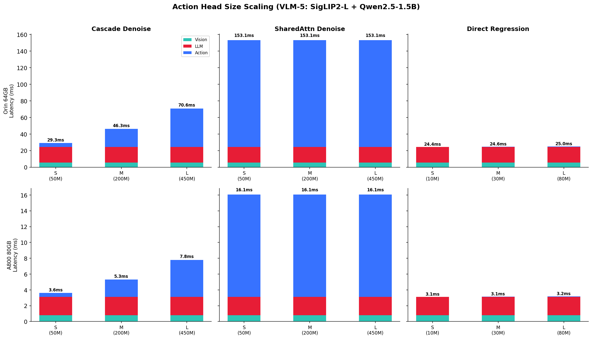
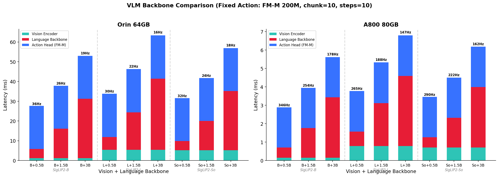
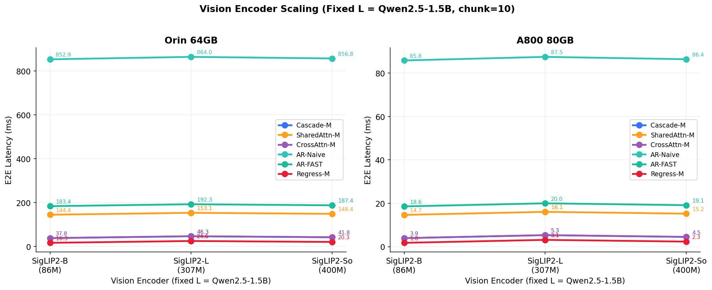
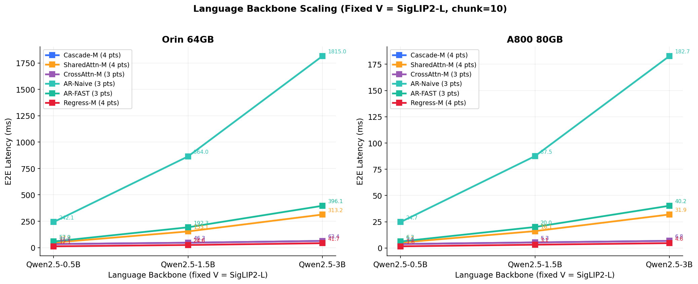
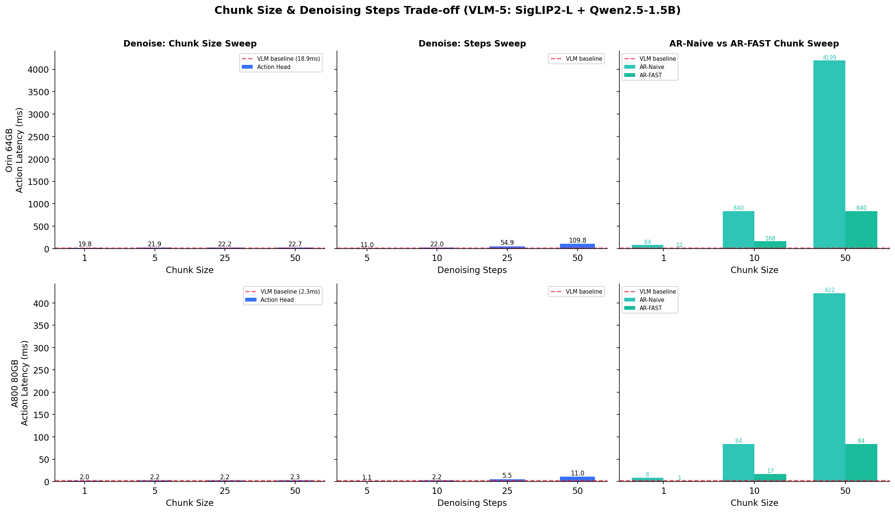

# VLA Architecture Latency Analysis Report

> Benchmark: 80 VLA configurations × 2 hardware platforms
> Hardware: Jetson AGX Orin 64GB (Edge) | A800 80GB (Server)
> Precision: BF16 | Batch size: 1 | Default: chunk_size=10, denoising_steps=10

## 1. Action Head Topology Comparison

**Setup:** Fixed VLM-5 (SigLIP2-L 307M + Qwen2.5-1.5B), compare 6 action topologies.

### Key Findings

| Topology | Orin Latency | A800 Latency | Action % of E2E (Orin) |
|----------|:-----------:|:-----------:|:---:|
| **Direct Regression** | 24.6ms (41Hz) | 3.1ms (318Hz) | 1% |
| **Cascade Denoise** (200M) | 46.3ms (22Hz) | 5.3ms (188Hz) | 47% |
| **CrossAttn Denoise** (200M) | 46.3ms (22Hz) | 5.3ms (188Hz) | 47% |
| **SharedAttn Denoise** (VLM) | 153ms (7Hz) | 16ms (62Hz) | 84% |
| **AR-FAST** (DCT+BPE) | 192ms (5Hz) | 20ms (50Hz) | 87% |
| **AR-Naive** (per-dim tokens) | 864ms (1Hz) | 87ms (11Hz) | 97% |

**Insight 1: Topology matters more than model size.**
Cascade Denoise (200M DiT) is 3.3x faster than SharedAttn (using 1.5B VLM), despite SharedAttn having no extra parameters. This is because SharedAttn runs the full VLM backbone per denoising step, while Cascade only runs a lightweight DiT.

**Insight 2: AR-FAST achieves 5x speedup over AR-Naive.**
DCT+BPE compression reduces token count from 70 to 14, but AR-FAST is still 4x slower than Cascade Denoise because even 14 sequential decode steps through a 1.5B LLM are expensive.

**Insight 3: Direct Regression is essentially free.**
Action head latency is <1% of E2E. The bottleneck is entirely in VLM prefill. This makes Regression ideal for latency-critical deployments where action quality is sufficient.

**Insight 4: Cascade = CrossAttn in our analytical model.**
Both use the same size DiT with cross-attention to VLM features. The difference is architectural (Cascade is sequential VLM→DiT, CrossAttn has interleaved SA+CA blocks), but from a FLOPs/memory perspective they're equivalent. Real implementations may differ due to kernel fusion opportunities.

## 2. Action Head Size Scaling

**Setup:** Fixed VLM-5, scale action head from S(50M) to L(450M).

### Key Findings

| Topology | S → M → L Latency (Orin) | Scaling Factor |
|----------|:-----------------------:|:-:|
| Cascade Denoise | 29ms → 46ms → 71ms | 2.4x |
| SharedAttn Denoise | 153ms → 153ms → 153ms | **1.0x** |
| Direct Regression | 24.4ms → 24.6ms → 25.0ms | **1.0x** |

**Insight 5: SharedAttn latency is invariant to "expert size".**
SharedAttn reuses the VLM backbone for denoising — the "action expert" config is ignored. Latency is determined entirely by VLM size × denoising steps. This is a fundamental property of the pi0-style architecture.

**Insight 6: Regression is also size-invariant in practice.**
MLP heads are so lightweight (10M-80M) that they contribute <3% of E2E latency at any size. The VLM prefill dominates.

**Insight 7: Cascade/CrossAttn scales ~2.4x from S to L.**
Going from 50M to 450M DiT adds significant action latency, but on A800 server the gap is smaller (3.6ms → 7.8ms) because the DiT is memory-bound and server has 10x more memory bandwidth.

## 3. VLM Backbone Comparison

**Setup:** Fixed Cascade-M action head, compare all 9 V×L backbone combinations.

### Key Findings

**Insight 8: Language backbone dominates latency.**
On Orin, scaling L from 0.5B to 3B adds 26ms (+100%), while scaling V from SigLIP2-B to SigLIP2-So adds only 4ms (+15%). On A800, the pattern is identical but compressed (L: +3ms, V: +0.5ms).

**Insight 9: Vision encoder choice barely matters for latency.**
SigLIP2-B (86M) vs SigLIP2-So (400M) = <5ms difference on Orin, <1ms on A800. Choose vision encoder for accuracy, not speed.

## 4. Vision Encoder Scaling

**Setup:** Fixed L=Qwen2.5-1.5B, sweep V across all 6 topologies.

**Insight 10: All topology curves are nearly flat w.r.t. vision encoder.**
The action topology choice creates a constant latency offset that dwarfs any vision-related variation. AR-Naive is always ~20x slower than Regression regardless of which vision encoder is used.

## 5. Language Backbone Scaling

**Setup:** Fixed V=SigLIP2-L, sweep L across all 6 topologies.

### Key Findings

**Insight 11: AR topologies scale quadratically with L size.**
AR-Naive on Orin: 0.5B→24ms, 1.5B→192ms, 3B→1540ms. This is because AR uses the full LLM for each token, and larger LLMs are proportionally slower per token × more tokens.

**Insight 12: SharedAttn also scales aggressively with L.**
Since SharedAttn runs the VLM per denoising step, larger VLMs directly multiply action cost.

**Insight 13: Cascade/CrossAttn/Regression are L-resilient.**
Their action latency is independent of L size (separate DiT / MLP), so the gap between them and AR/SharedAttn widens as L grows.

## 6. Chunk Size & Denoising Steps Trade-off

**Setup:** VLM-5 with Cascade-M and AR-Naive/AR-FAST.

### Key Findings

**Insight 14: Denoise chunk scaling is near-constant.**
Cascade-M action time: chunk=1 → 19.8ms, chunk=50 → 22.7ms (+15%). This is because all action tokens are decoded in parallel per denoising step.

**Insight 15: Denoise steps scaling is perfectly linear.**
5 steps → 11ms, 10 steps → 22ms, 50 steps → 110ms. Each step adds exactly the same cost.

**Insight 16: AR-Naive chunk scaling is devastating.**
chunk=1 → 84ms, chunk=10 → 840ms, chunk=50 → 4200ms. Linear in (dof × chunk), making large chunks impractical.

**Insight 17: AR-FAST compresses this by ~5x.**
chunk=50 → 840ms instead of 4200ms. Still much slower than denoise-based methods at large chunks.

## 7. Architecture Ranking Summary

### Edge (Jetson AGX Orin 64GB)

| Rank | Topology | E2E at VLM-5 | Best For |
|:---:|----------|:-----------:|----------|
| 1 | Direct Regression | 24.6ms (41Hz) | Latency-critical, simple tasks |
| 2 | Cascade Denoise S | 29.3ms (34Hz) | Good accuracy/latency balance |
| 3 | Cascade Denoise M | 46.3ms (22Hz) | High accuracy with moderate latency |
| 4 | SharedAttn Denoise | 153ms (7Hz) | pi0-style, KV cache efficiency |
| 5 | AR-FAST | 192ms (5Hz) | Autoregressive with compression |
| 6 | AR-Naive | 864ms (1Hz) | Not recommended for real-time |

### Server (A800 80GB)

| Rank | Topology | E2E at VLM-5 | Best For |
|:---:|----------|:-----------:|----------|
| 1 | Direct Regression | 3.1ms (318Hz) | Latency-critical |
| 2 | Cascade Denoise S | 3.6ms (276Hz) | Best accuracy/latency |
| 3 | Cascade Denoise M | 5.3ms (188Hz) | High accuracy |
| 4 | SharedAttn Denoise | 16ms (62Hz) | KV cache efficiency |
| 5 | AR-FAST | 20ms (50Hz) | Compressed autoregressive |
| 6 | AR-Naive | 87ms (11Hz) | Not recommended |

### Design Guidelines

1. **10Hz target (Edge):** Use Regression or Cascade-S/M. L should be ≤1.5B.
2. **50Hz target (Server):** Any topology except AR-Naive works. Regression + large L gives best accuracy per Hz.
3. **Minimize action head overhead:** Regression (0%) > Cascade-S (17%) > Cascade-M (47%) > SharedAttn (84%)
4. **Scale L, not V:** Each dollar spent on larger L gives more accuracy than on larger V, with minimal latency impact for Cascade/Regression.
5. **Avoid AR-Naive for chunk > 5:** Latency becomes prohibitive. Use AR-FAST or switch to denoise-based methods.
